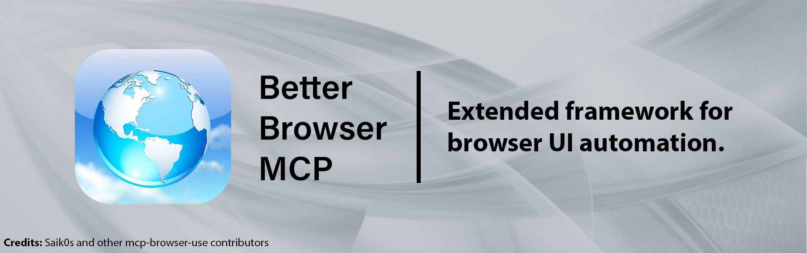

# **Better-Browser-MCP**





## Abstract and Explanation

Practical MCP server for browser automation and web research. Single-window with tabs-only concurrency, smart search control, and a documentation-first mode that extracts headings, API symbols, anchors, and code from official docs.

## Improvements and Effectivity Upgrades

- Tabs-only concurrency with one window (cleaner UX, fewer surprises)
- Unified tool `run_research` with modes: `auto | task | research | documentation | deep_research`
- Search control: choose engine (`bing|ddg|brave|google|custom`) and optionally block Google
- Documentation profiles (auto-detected): MDN, Python/Sphinx, ReadTheDocs, Rust, Go pkg, Node.js API, .NET API, Java (Oracle/Javadoc), Apple Docs

## Setup & Use Instructions

1) Install Playwright (one-time):

```powershell
$uvx = "$env:USERPROFILE\.local\bin\uvx.exe"; if (!(Test-Path $uvx)) { $uvx = "uvx" };
& $uvx --from git+https://github.com/caarson/better-browser-mcp@main python -m playwright install
```

2) Run the server (choose one):

Option A — Run from source (this repo; recommended to validate local changes like the overlay):

```powershell
$env:MCP_SERVER_LOGGING_LEVEL = "INFO"
$env:MCP_RESEARCH_TOOL_SAVE_DIR = "$PWD\research-out"
# Runs using the code in this workspace (no GitHub fetch)
uv --directory . run mcp-server-browser-use
```

Option B — Run from GitHub (main branch):

```powershell
$env:MCP_SERVER_LOGGING_LEVEL = "INFO"
$env:MCP_RESEARCH_TOOL_SAVE_DIR = "$PWD\research-out"
$uvx = "$env:USERPROFILE\.local\bin\uvx.exe"; if (!(Test-Path $uvx)) { $uvx = "uvx" };
& $uvx --from git+https://github.com/caarson/better-browser-mcp@main mcp-server-browser-use
```

Notes:
- The overlay badge appears during actions (navigating, searching, extracting). It won’t show while idle between steps.
- If you prefer Python directly, you can also run: `uv --directory . run python -m mcp_server_browser_use`.

3) Minimal MCP client config:

```json
{
  "mcpServers": {
    "github.com/caarson/better-browser-mcp": {
      "autoApprove": [],
      "disabled": false,
      "timeout": 500000,
      "type": "stdio",
      "command": "C:\\Users\\imitr\\.local\\bin\\uvx.exe",
      "args": [
        "--from",
        "git+https://github.com/caarson/better-browser-mcp",
        "mcp-server-browser-use"
      ],
      "env": {
        "MCP_LLM_PROVIDER": "openai",
        "MCP_LLM_BASE_URL": "http://127.0.0.1:8088/v1",
        "MCP_LLM_OPENAI_API_KEY": "lm-studio",
        "MCP_LLM_MODEL_NAME": "nvidia_nvidia-nemotron-nano-9b-v2@q3_k_l",
        "MCP_BROWSER_HEADLESS": "false",
        "MCP_SERVER_LOGGING_LEVEL": "DEBUG",
        "MCP_AGENT_TOOL_USE_VISION": "false",
        "MCP_SEARCH_ENGINE": "brave",
        "MCP_BLOCK_GOOGLE": "true"
      }
    }
  }
}
```

4) Tools at a glance:

- `run_research(topic_or_task, mode=auto|task|research|documentation|deep_research, max_windows?)`
- `run_documentation(topic_or_task)`
- `run_auto(topic_or_task)`
- `run_task(task)`
- `run_deep_research(research_task, max_windows?)`

Parameters (env vars) — summarize only the most useful:

- LLM (`MCP_LLM_*`): `PROVIDER`, `MODEL_NAME`, `TEMPERATURE`, `API_KEY`/provider keys; endpoints optional; planner optional
- Browser (`MCP_BROWSER_*`): `HEADLESS`, `KEEP_OPEN`, `USER_DATA_DIR`, `BINARY_PATH`, `WINDOW_WIDTH`, `WINDOW_HEIGHT`, `USE_OWN_BROWSER`, `CDP_URL`
- Agent (`MCP_AGENT_TOOL_*`): `MAX_STEPS`, `MAX_ACTIONS_PER_STEP`, `USE_VISION`, recording/history paths
- Research (`MCP_RESEARCH_TOOL_*`): `SAVE_DIR`, `MAX_WINDOWS` (or `MAX_PARALLEL_BROWSERS`)
- Paths (`MCP_PATHS_*`): `DOWNLOADS`
- Server (`MCP_SERVER_*`): `LOGGING_LEVEL`, `LOG_FILE`, `MCP_CONFIG` (JSON)
- Search: `MCP_SEARCH_ENGINE`, `MCP_BLOCK_GOOGLE`, `MCP_SEARCH_URL_TEMPLATE` or `MCP_SEARCH_ENGINE_URL` + `MCP_SEARCH_QUERY_PARAM`

Sample .env

```dotenv
MCP_LLM_PROVIDER=google
MCP_LLM_GOOGLE_API_KEY=YOUR_KEY
MCP_LLM_MODEL_NAME=gemini-2.5-flash-preview-04-17
MCP_BROWSER_HEADLESS=true
MCP_RESEARCH_TOOL_SAVE_DIR=./research-out
MCP_SEARCH_ENGINE=bing
MCP_SERVER_LOGGING_LEVEL=INFO
```

## Troubleshooting

- Exit Code 1: ensure Playwright is installed, set a valid `MCP_RESEARCH_TOOL_SAVE_DIR`, then set `MCP_SERVER_LOGGING_LEVEL=DEBUG` and re-run to capture logs.
- Page opens but blank tab persists: tabs model auto-closes `about:blank`; ensure you’re on latest main.

## Credits

- Original project: https://github.com/Saik0s/mcp-browser-use
- This fork: https://github.com/caarson/better-browser-mcp

<p align="center">
  
</p>
- Deep Research: `MCP_RESEARCH_TOOL_SAVE_DIR`, `MCP_RESEARCH_TOOL_MAX_WINDOWS` (default: 1 here). Legacy alias supported: `MCP_RESEARCH_TOOL_MAX_PARALLEL_BROWSERS`.
- Router: `MCP_TASK_ROUTER_MODE=auto|always-task|always-research`.
- Unified mode: `MCP_RESEARCH_MODE=auto|task|research|deep_research`.

### Search engine options

Control search behavior and redirects when the agent initiates searches or navigates to google.* URLs:

```dotenv
# Default engine is Bing
MCP_SEARCH_ENGINE=bing  # options: bing | ddg | google | brave | custom

# Optionally block Google; if true and engine=google, auto-fallback to ddg
MCP_BLOCK_GOOGLE=false

# Example forcing Bing and blocking Google redirects
# MCP_SEARCH_ENGINE=bing
# MCP_BLOCK_GOOGLE=true

# Brave Search (built-in)
# MCP_SEARCH_ENGINE=brave

# Custom search (two options):
# A) URL template with {q}
# MCP_SEARCH_ENGINE=custom
# MCP_SEARCH_URL_TEMPLATE=https://kagi.com/search?q={q}

# B) Base URL + query param name
# MCP_SEARCH_ENGINE=custom
# MCP_SEARCH_ENGINE_URL=https://search.brave.com/search
# MCP_SEARCH_QUERY_PARAM=q
```

## Configuration (Environment Variables)

Configure the server and CLI using environment variables. You can set these in your system or place them in a `.env` file in the project root (use `--env-file` for CLI). Variables are structured with prefixes.


| Variable Group (Prefix)                | Example Variable                      | Description                                                                                                              | Default Value                        |
| :--------------------------------------- | :-------------------------------------- | :------------------------------------------------------------------------------------------------------------------------- | :------------------------------------- |
| **Main LLM (MCP_LLM_)**                |                                       | Settings for the primary LLM used by agents.                                                                             |                                      |
|                                        | `MCP_LLM_PROVIDER`                    | LLM provider. Options:`openai`, `azure_openai`, `anthropic`, `google`, `mistral`, `ollama`, etc.                         | `openai`                             |
|                                        | `MCP_LLM_MODEL_NAME`                  | Specific model name for the provider.                                                                                    | `gpt-4.1`                            |
|                                        | `MCP_LLM_TEMPERATURE`                 | LLM temperature (0.0-2.0).                                                                                               | `0.0`                                |
|                                        | `MCP_LLM_BASE_URL`                    | Optional: Generic override for LLM provider's base URL.                                                                  | Provider-specific                    |
|                                        | `MCP_LLM_API_KEY`                     | Optional: Generic LLM API key (takes precedence).                                                                        | -                                    |
|                                        | `MCP_LLM_OPENAI_API_KEY`              | API Key for OpenAI (if provider is`openai`).                                                                             | -                                    |
|                                        | `MCP_LLM_ANTHROPIC_API_KEY`           | API Key for Anthropic.                                                                                                   | -                                    |
|                                        | `MCP_LLM_GOOGLE_API_KEY`              | API Key for Google AI (Gemini).                                                                                          | -                                    |
|                                        | `MCP_LLM_AZURE_OPENAI_API_KEY`        | API Key for Azure OpenAI.                                                                                                | -                                    |
|                                        | `MCP_LLM_AZURE_OPENAI_ENDPOINT`       | **Required if using Azure.** Your Azure resource endpoint.                                                               | -                                    |
|                                        | `MCP_LLM_OLLAMA_ENDPOINT`             | Ollama API endpoint URL.                                                                                                 | `http://localhost:11434`             |
|                                        | `MCP_LLM_OLLAMA_NUM_CTX`              | Context window size for Ollama models.                                                                                   | `32000`                              |
| **Planner LLM (MCP_LLM_PLANNER_)**     |                                       | Optional: Settings for a separate LLM for agent planning. Defaults to Main LLM if not set.                               |                                      |
|                                        | `MCP_LLM_PLANNER_PROVIDER`            | Planner LLM provider.                                                                                                    | Main LLM Provider                    |
|                                        | `MCP_LLM_PLANNER_MODEL_NAME`          | Planner LLM model name.                                                                                                  | Main LLM Model                       |
| **Browser (MCP_BROWSER_)**             |                                       | General browser settings.                                                                                                |                                      |
|                                        | `MCP_BROWSER_HEADLESS`                | Run browser without UI (general setting).                                                                                | `false`                              |
|                                        | `MCP_BROWSER_DISABLE_SECURITY`        | Disable browser security features (general setting, use cautiously).                                                     | `false`                              |
|                                        | `MCP_BROWSER_BINARY_PATH`             | Path to Chrome/Chromium executable.                                                                                      | -                                    |
|                                        | `MCP_BROWSER_USER_DATA_DIR`           | Path to Chrome user data directory.                                                                                      | -                                    |
|                                        | `MCP_BROWSER_WINDOW_WIDTH`            | Browser window width (pixels).                                                                                           | `1280`                               |
|                                        | `MCP_BROWSER_WINDOW_HEIGHT`           | Browser window height (pixels).                                                                                          | `1080`                               |
|                                        | `MCP_BROWSER_USE_OWN_BROWSER`         | Connect to user's browser via CDP URL.                                                                                   | `false`                              |
|                                        | `MCP_BROWSER_CDP_URL`                 | CDP URL (e.g.,`http://localhost:9222`). Required if `MCP_BROWSER_USE_OWN_BROWSER=true`.                                  | -                                    |
|                                        | `MCP_BROWSER_KEEP_OPEN`               | Keep server-managed browser open between MCP calls (if`MCP_BROWSER_USE_OWN_BROWSER=false`).                              | `false`                              |
|                                        | `MCP_BROWSER_TRACE_PATH`              | Optional: Directory to save Playwright trace files. If not set, tracing to file is disabled.                             | ` ` (empty, tracing disabled)        |
| **Agent Tool (MCP_AGENT_TOOL_)**       |                                       | Settings for the`run_browser_agent` tool.                                                                                |                                      |
|                                        | `MCP_AGENT_TOOL_MAX_STEPS`            | Max steps per agent run.                                                                                                 | `100`                                |
|                                        | `MCP_AGENT_TOOL_MAX_ACTIONS_PER_STEP` | Max actions per agent step.                                                                                              | `5`                                  |
|                                        | `MCP_AGENT_TOOL_TOOL_CALLING_METHOD`  | Method for tool invocation ('auto', 'json_schema', 'function_calling').                                                  | `auto`                               |
|                                        | `MCP_AGENT_TOOL_MAX_INPUT_TOKENS`     | Max input tokens for LLM context.                                                                                        | `128000`                             |
|                                        | `MCP_AGENT_TOOL_USE_VISION`           | Enable vision capabilities (screenshot analysis).                                                                        | `true`                               |
|                                        | `MCP_AGENT_TOOL_HEADLESS`             | Override`MCP_BROWSER_HEADLESS` for this tool (true/false/empty).                                                         | ` ` (uses general)                   |
|                                        | `MCP_AGENT_TOOL_DISABLE_SECURITY`     | Override`MCP_BROWSER_DISABLE_SECURITY` for this tool (true/false/empty).                                                 | ` ` (uses general)                   |
|                                        | `MCP_AGENT_TOOL_ENABLE_RECORDING`     | Enable Playwright video recording.                                                                                       | `false`                              |
|                                        | `MCP_AGENT_TOOL_SAVE_RECORDING_PATH`  | Optional: Path to save recordings. If not set, recording to file is disabled even if`ENABLE_RECORDING=true`.             | ` ` (empty, recording disabled)      |
|                                        | `MCP_AGENT_TOOL_HISTORY_PATH`         | Optional: Directory to save agent history JSON files. If not set, history saving is disabled.                            | ` ` (empty, history saving disabled) |
| **Research Tool (MCP_RESEARCH_TOOL_)** |                                       | Settings for the`run_deep_research` tool.                                                                                |                                      |
|                                        | `MCP_RESEARCH_TOOL_MAX_WINDOWS`       | Max parallel browser windows for deep research. Legacy alias:`MCP_RESEARCH_TOOL_MAX_PARALLEL_BROWSERS`.                  | `1`                                  |
|                                        | `MCP_RESEARCH_TOOL_SAVE_DIR`          | Optional: Base directory to save research artifacts. Task ID will be appended. If not set, operates in memory-only mode. | `None`                               |
| **Paths (MCP_PATHS_)**                 |                                       | General path settings.                                                                                                   |                                      |
|                                        | `MCP_PATHS_DOWNLOADS`                 | Optional: Directory for downloaded files. If not set, persistent downloads to a specific path are disabled.              | ` ` (empty, downloads disabled)      |
| **Server (MCP_SERVER_)**               |                                       | Server-specific settings.                                                                                                |                                      |
|                                        | `MCP_SERVER_LOG_FILE`                 | Path for the server log file. Empty for stdout.                                                                          | ` ` (empty, logs to stdout)          |
|                                        | `MCP_SERVER_LOGGING_LEVEL`            | Logging level (`DEBUG`, `INFO`, `WARNING`, `ERROR`, `CRITICAL`).                                                         | `ERROR`                              |
|                                        | `MCP_SERVER_ANONYMIZED_TELEMETRY`     | Enable/disable anonymized telemetry (`true`/`false`).                                                                    | `true`                               |
|                                        | `MCP_SERVER_MCP_CONFIG`               | Optional: JSON string for MCP client config used by the internal controller.                                             | `null`                               |

| **Search (MCP_*)**                  |                                                | Web search engine configuration for the built-in "search_google" action.                                   |                                   |
|                                     | `MCP_SEARCH_ENGINE`                            | Which search engine to use when the agent triggers a search. Options: `bing`, `ddg`, `google`, `brave`, `custom`. | `bing`                            |
|                                     | `MCP_BLOCK_GOOGLE`                             | If `true` and the engine is `google`, the search will automatically fall back to DuckDuckGo. Also rewrites Google search URLs before navigation. | `false`                           |

**Supported LLM Providers (`MCP_LLM_PROVIDER`):**
`openai`, `azure_openai`, `anthropic`, `google`, `mistral`, `ollama`, `deepseek`, `openrouter`, `alibaba`, `moonshot`, `unbound`

*(Refer to `.env.example` for a comprehensive list of all supported environment variables and their specific provider keys/endpoints.)*

### Search engine options

Set these to control the built-in search action behavior:

```dotenv
# Default engine is Bing
MCP_SEARCH_ENGINE=bing  # options: bing | ddg | google | brave | custom

# Optionally block Google; if true and engine=google, auto-fallback to ddg
MCP_BLOCK_GOOGLE=false

# Example forcing Bing and blocking Google redirects
# MCP_SEARCH_ENGINE=bing
# MCP_BLOCK_GOOGLE=true

# Example using Brave Search (built-in)
# MCP_SEARCH_ENGINE=brave

# Use a custom engine (two options):
# A) Provide a URL template that includes {q}
# MCP_SEARCH_ENGINE=custom
# MCP_SEARCH_URL_TEMPLATE=https://kagi.com/search?q={q}

# B) Provide a base URL and the query param name
# MCP_SEARCH_ENGINE=custom
# MCP_SEARCH_ENGINE_URL=https://search.brave.com/search
# MCP_SEARCH_QUERY_PARAM=q
```

## Connecting to Your Own Browser (CDP)

Instead of having the server launch and manage its own browser instance, you can connect it to a Chrome/Chromium browser that you launch and manage yourself.

**Steps:**

1. **Launch Chrome/Chromium with Remote Debugging Enabled:**
   (Commands for macOS, Linux, Windows as previously listed, e.g., `google-chrome --remote-debugging-port=9222`)
2. **Configure Environment Variables:**
   Set the following environment variables:

   ```dotenv
   MCP_BROWSER_USE_OWN_BROWSER=true
   MCP_BROWSER_CDP_URL=http://localhost:9222 # Use the same port
   # Optional: MCP_BROWSER_USER_DATA_DIR=/path/to/your/profile
   ```
3. **Run the MCP Server or CLI:**
   Start the server (`uv run mcp-server-browser-use`) or CLI (`mcp-browser-cli ...`) as usual.

**Important Considerations:**

* The browser launched with `--remote-debugging-port` must remain open.
* Settings like `MCP_BROWSER_HEADLESS` and `MCP_BROWSER_KEEP_OPEN` are ignored when `MCP_BROWSER_USE_OWN_BROWSER=true`.

## Development

```bash
# Install dev dependencies and sync project deps
uv sync --dev

# Install playwright browsers
uv run playwright install

# Run MCP server with debugger (Example connecting to own browser via CDP)
# 1. Launch Chrome: google-chrome --remote-debugging-port=9222 --user-data-dir="optional/path/to/user/profile"
# 2. Run inspector command with environment variables:
npx @modelcontextprotocol/inspector@latest \
  -e MCP_LLM_GOOGLE_API_KEY=$GOOGLE_API_KEY \
  -e MCP_LLM_PROVIDER=google \
  -e MCP_LLM_MODEL_NAME=gemini-2.5-flash-preview-04-17 \
  -e MCP_BROWSER_USE_OWN_BROWSER=true \
  -e MCP_BROWSER_CDP_URL=http://localhost:9222 \
  -e MCP_RESEARCH_TOOL_SAVE_DIR=./tmp/dev_research_output \
  uv --directory . run mcp-server-browser-use

# Note: Change timeout in inspector's config panel if needed (default is 10 seconds)

# Run CLI example
# Create a .env file with your settings (including MCP_RESEARCH_TOOL_SAVE_DIR) or use environment variables
uv run mcp-browser-cli -e .env run-browser-agent "What is the title of example.com?"
uv run mcp-browser-cli -e .env run-deep-research "What is the best material for a pan for everyday use on amateur kitchen and dishwasher?"

# Prefer running from the GitHub fork while PR is pending
uvx --from git+https://github.com/caarson/mcp-browser-use mcp-server-browser-use
```

## Troubleshooting

- **Configuration Error on Startup**: If the application fails to start with an error about a missing setting, ensure all **mandatory** environment variables (like `MCP_RESEARCH_TOOL_SAVE_DIR`) are set correctly in your environment or `.env` file.
- **Browser Conflicts**: If *not* using CDP (`MCP_BROWSER_USE_OWN_BROWSER=false`), ensure no conflicting Chrome instances are running with the same user data directory if `MCP_BROWSER_USER_DATA_DIR` is specified.
- **CDP Connection Issues**: If using `MCP_BROWSER_USE_OWN_BROWSER=true`:
  * Verify Chrome was launched with `--remote-debugging-port`.
  * Ensure the port in `MCP_BROWSER_CDP_URL` matches.
  * Check firewalls and ensure the browser is running.
- **API Errors**: Double-check API keys (`MCP_LLM_<PROVIDER>_API_KEY` or `MCP_LLM_API_KEY`) and endpoints (e.g., `MCP_LLM_AZURE_OPENAI_ENDPOINT` for Azure).
- **Vision Issues**: Ensure `MCP_AGENT_TOOL_USE_VISION=true` and your LLM supports vision.
- **Dependency Problems**: Run `uv sync` and `uv run playwright install`.
- **File/Path Issues**:
  * If optional features like history saving, tracing, or downloads are not working, ensure the corresponding path variables (`MCP_AGENT_TOOL_HISTORY_PATH`, `MCP_BROWSER_TRACE_PATH`, `MCP_PATHS_DOWNLOADS`) are set and the application has write permissions to those locations.
  * For deep research, ensure `MCP_RESEARCH_TOOL_SAVE_DIR` is set to a valid, writable directory.
- **Logging**: Check the log file (`MCP_SERVER_LOG_FILE`, if set) or console output. Increase `MCP_SERVER_LOGGING_LEVEL` to `DEBUG` for more details. For CLI, use `--log-level DEBUG`.

## License

MIT - See [LICENSE](LICENSE) for details.
